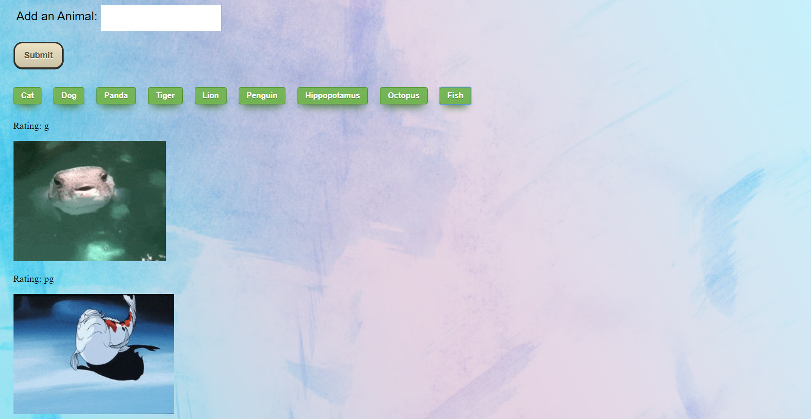

# GifTastic

### This s a very interesting project as we start to load the gif to our pge with search key word

### The steps I used when create this project
- I first set a submit buttom with submit new animals, I think this will be more clear when users logging to my page
- I create an array of animals which I want the array of animals to load when the first time my page is loading
- We each time we click the buttom, the animal gifs will be loading on the page

### When you fist loading to the page

### When you click the Cat Button

### You may add one animal name, and I add Fish as an example

Technologies I used in this project:
- HTML
- CSS
- Javascript
- Jquery
- API
- Giphy